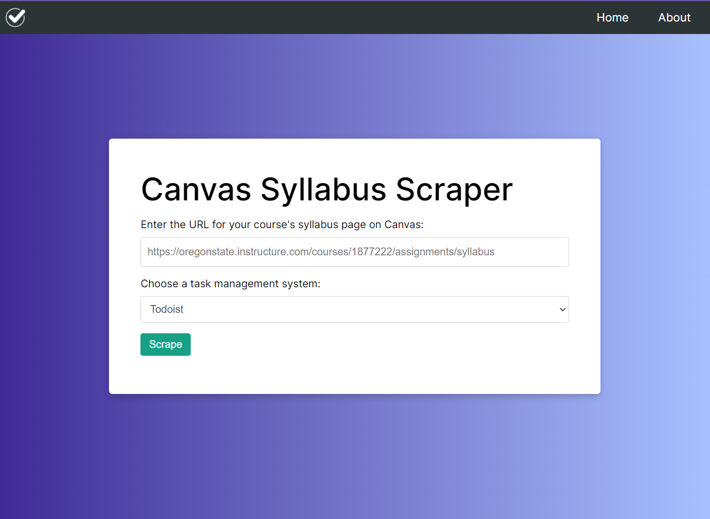

## About

Canvas Syllabus Scraper is a web app that was designed so that students don't have to manually enter in tasks from [Canvas](https://www.instructure.com/canvas) into their task management systems at the beginning of every quarter/semester. Upon entering the URL for a course's syllabus page on Canvas, the app will scrape the syllabus content and output a CSV that can be imported into your task management system\*. The CSV contains the task name and due date for every task on the syllabus.

_\*Currently, only Todoist and Asana are supported._

## Demo

The application is hosted on Heroku. Click [here](https://canvas-syllabus-scraper.herokuapp.com/) to access the live demo.

## Todo

- [ ] Double check Asana import
- [ ] Test against non-OSU courses
- [ ] Address instances where date range is given in 'Due' column (e.g. "6:15pm to 9:15pm" in https://canvas.northwestern.edu/courses/7060/assignments/syllabus)
- [ ] Allow user to enter assignee #asana-assignee branch
- [ ] Refactor code
- [ ] Implement caching system
- [ ] Display tasks to user prior to download
- [ ] Add support for other todo apps
  - [ ] Microsoft To Do
  - [ ] TickTick
  - [ ] Things 3
